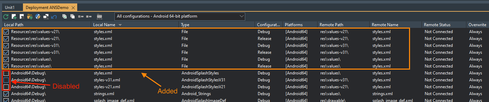

# Android "No Splash" demo

## Description

Demonstrates how to suppress (in a way) the splash screen in an Android app

This solution is based on "Approach 1" given in [this answer on Stack Overflow](https://stackoverflow.com/a/68430880/3164070)

## Configuration

The "trick" is to "override" the `styles.xml` files that are normally deployed by Delphi, and deploy your own versions. In the demo, these files are under the `Resources\res` folder.

Add these files to the deployment using Deployment Manager window, and **disable** the default files thus:

