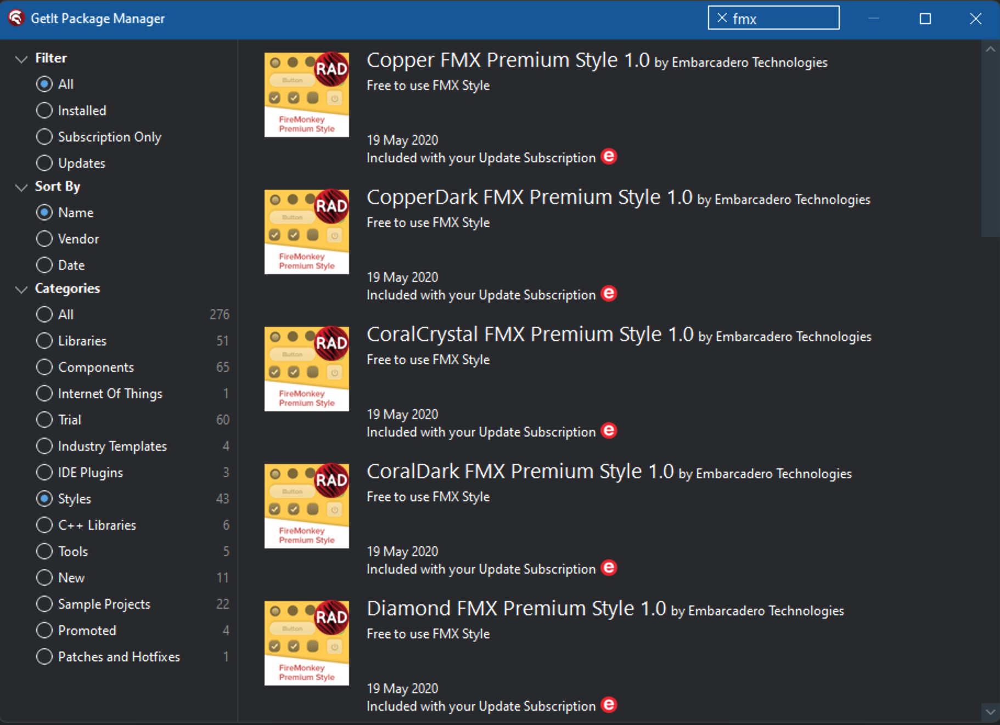
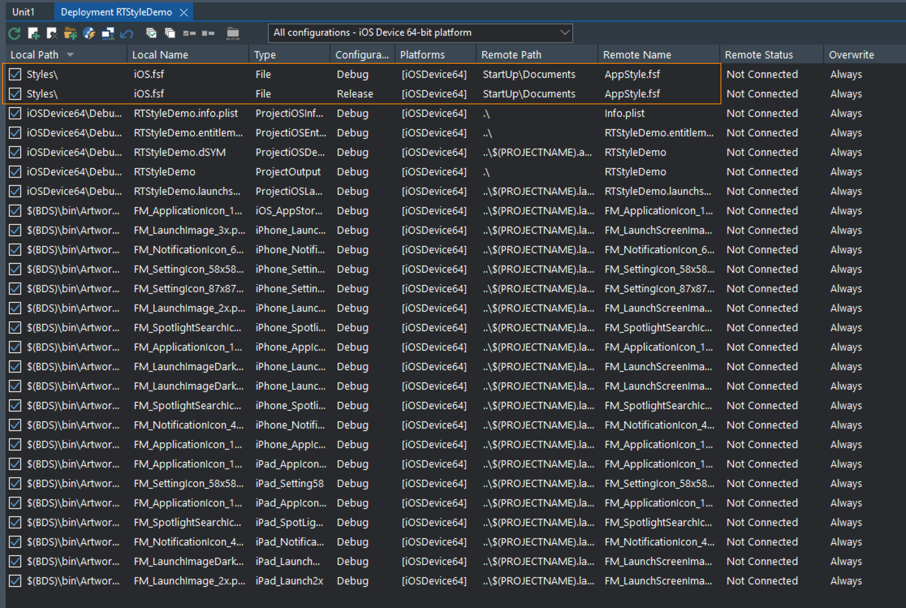

# Runtime Style demo

## Description

Demonstrates a method of using FMX styles at runtime, that load as fast as using styles in a `TStyleBook` which are set at design time 

**NOTE: Before this demo will work, you will need to provide the respective `.fsf` files in the `Styles` folder of the demo. Please read the instructions below as to how.**

## Style files

Delphi comes with a number of prebuilt style files, which are located under the `Styles` folder in folder names that match the platform (e.g. Android, iOS, maOS) under `Embarcadero\Studio\nn.n` (where nn.n refers to the product version e.g. 22.0 for Delphi 11), under the `Public Documents` folder on your machine, e.g:

`C:\Users\Public\Documents\Embarcadero\Studio\22.0\Styles`

There are even more styles that can be installed via GetIt. In Delphi, click `Tools` > `Get It Package Manager`, select the `Styles` category, and if you are just after FMX styles, type `FMX` into the filter box:



There are also a number of excellent styles available for purchase from [DelphiStyles](http://delphistyles.com/fmx/index.html)

### Converting `.vsf` file to `.style` files

The steps to convert are:

1. Start the Bitmap Style Designer from Delphi (under the `Tools` menu)
2. Load the desired `.vsf` file
3. Save it as a `.style` file

### Converting `.style` files to `.fsf` files

`.fsf` files are the binary version of FMX styles, and are what will be deployed with the app (see the Configuration section, below) 

Use the [`StyleToFSF` tool from Kastri](https://github.com/DelphiWorlds/Kastri/blob/master/Tools/StyleToFSF.exe) to convert the `.style` file to a `.fsf` file, e.g.:
```
  StyleToFSF MyStyle.style MyStyle.fsf
```

A planned enhancement is to automate these steps so the process can go straight from a `.vsf` file to an `.fsf` file

## Configuration

**Use one of either the Resources method or Deployment Manager method** - I'm not sure if there's any point in using both, however both methods are included in the demo for demonstration purposes.

### Resources method

When creating your own project, and you add the .rc files (the demo has .rc files in the `Styles` folder) to the project (this is necessary for them to be compiled into the final .res files), you may note that the IDE adds a line in the project source for each of the .rc files, e.g.:

`{$R 'Style.iOS.res' 'Styles\Style.iOS.rc'}`

You will need to remove each of them because the `{$R}` directives are already included in the `Style.inc` file, and add an include directive at the top of the project source as per the demo, i.e.:

`{$I Styles\Style.inc}`

This include file has the necessary directives to ensure that the correct `.res` file is compiled with the app:

```
{$IF Defined(IOS)}
  {$R 'Style.iOS.res' 'Styles\Style.iOS.rc'}
{$ELSEIF Defined(ANDROID)}
  {$R 'Style.Android.res' 'Styles\Style.Android.rc'}
{$ELSE}
  {$R 'Style.Default.res' 'Styles\Style.Default.rc'}
{$ENDIF}
```

Using incudes in this manner minimizes disruptions to the project source by the IDE.

### Deployment Manager method

For each platform that you are targeting (other than Windows), add the relevant `.fsf` file to the deployment.

For Android, the `Remote Path` value is `assets\internal`
For iOS the `Remote Path` value is `StartUp\Documents`

For all of the platforms, the `Remote Filename` value is `AppStyle.fsf`. This means you will not have to use conditional defines at runtime. Example of Deployment Manager for iOS:



## Loading the style at runtime

Now it is a simple matter of, at startup, calling either:

`TStyleManager.TrySetStyleFromResource('AppStyle')` (if using the resource method)

**OR**

`TStyleManager.SetStyleFromFile(TPath.Combine(TPath.GetDocumentsPath, 'Style.fsf'))` (if using the deployment manager method)

Please see the code in Unit1 of the demo


