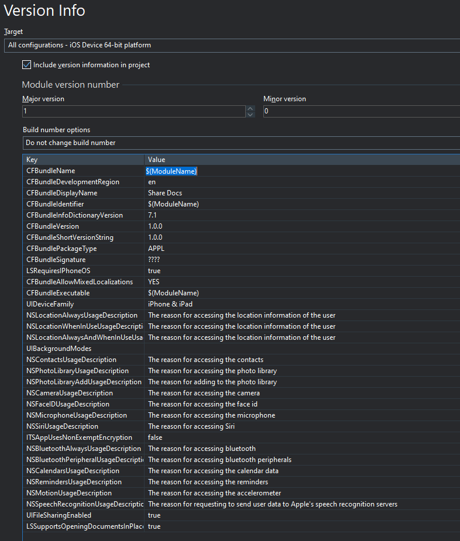

# Share Docs Demo

## Description

Demonstrates how to share documents on iOS, e.g. via the Files app

## Configuration

These are instructions for configuration in your own projects - they have already been done in the demo

Two items need to be added to the Version Info in Project Options:

* UIFileSharingEnabled
* LSSupportsOpeningDocumentsInPlace

Each with a value of: `true` (must be lower case)

To add these:

1. Right-click the grid in the Version Info section
2. Click Add Key
3. Enter the key name
4. Enter `true` for the value

Example:

Now, any files that you write in the **root** of the documents folder (the one returned by `TPath.GetDocumentsPath`) will be available via the Files app when selecting the On My iPhone item in the Locations list.

The demo has a sample file added to the deployment (Sample.pdf) which is deployed to a Remote Path of `.\StartUp\Documents` which corresponds to the documents folder of the app, so that you can see this feature in action.

