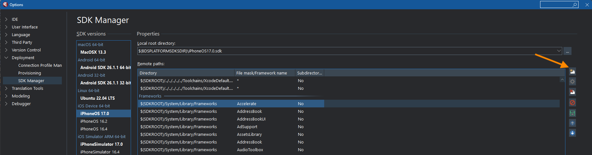
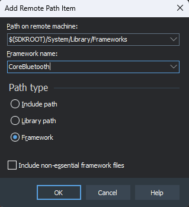

# Adding SDK Frameworks in Delphi

# Description

If you wish to leverage iOS and macOS frameworks other than those that support is provided for in Delphi, you’ll need to add the path to the framework in the SDK manager.

## Steps

1. Ensure that PAServer is running on your Mac
2. In Delphi's SDK Manager, select the relevant iOS or macOS SDK.
3. The Remote Paths list has distinct sections, namely: `Include Paths`, `Library Paths`, and `Framework Paths`. Select the **first** entry in the `Framework Paths` section (this ensures the correct Add dialog is used), and click the Add button:  
   
4. In the Path on remote machine combo edit, enter: `$(SDKROOT)/System/Library/Frameworks`, in the Framework name combo edit enter the framework name - **remember the name is CASE SENSITIVE** , and click OK:  
    
   Note that this screenshot is just using CoreBluetooth **as an example**. Ensure you enter the correct name for the desired framework. 

5. Click the Update Local File Cache button. Respond to any overwrite prompts by clicking: Yes To All.
6. Make sure you click Save once it is done, so that the SDK framework entries are updated.

Now you’ll be able to build your iOS/macOS project against the framework you’ve added.

