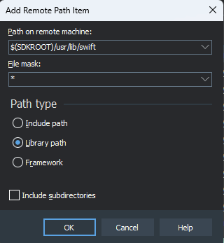
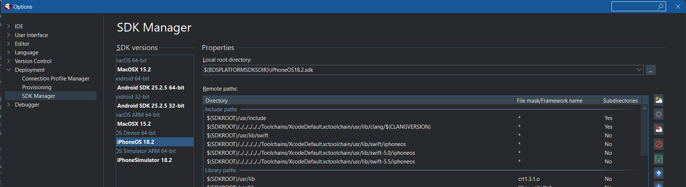
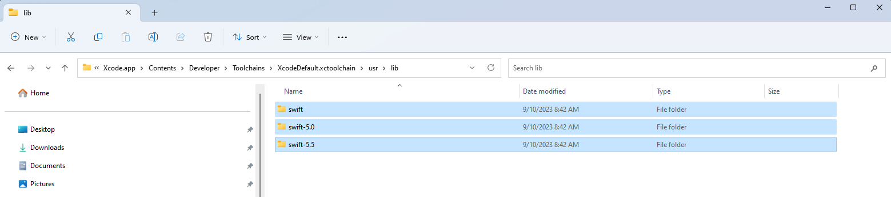
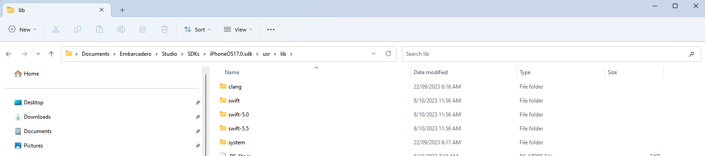

# Adding Swift Support files to Delphi

## Description

Some newer third-party iOS SDKs such as Firebase from v9.0.0 onwards require files from Xcode for compatibility with Swift. This is done via the SDK Manager in Delphi

## Steps

### Add the Swift framework from the iOS SDK, and the Swift support files from the Xcode Toolchain

1. Ensure that PAServer is running on your Mac
2. In Delphi's SDK Manager, select the relevant iOS SDK. At time of writing, the latest iOS SDK is 18.0. These instructions should work from at least iOS SDK 15.0
3. The Remote Paths list has distinct sections, namely: `Include Paths`, `Library Paths`, and `Framework Paths`. Select the last entry in the `Include Paths` section, and click the Add button.
4. In the Path on remote machine combo edit, enter: `$(SDKROOT)/usr/lib/swift`, in the File mask combo edit enter: `*` , and click OK:<br><br>
   
5. Repeat steps 3 to 4 **for each** of the following values for the Path on remote machine combo edit - 
   
   For iOS Devices:
   ```
   $(SDKROOT)/../../../../../Toolchains/XcodeDefault.xctoolchain/usr/lib/swift/iphoneos
   $(SDKROOT)/../../../../../Toolchains/XcodeDefault.xctoolchain/usr/lib/swift-5.0/iphoneos
   $(SDKROOT)/../../../../../Toolchains/XcodeDefault.xctoolchain/usr/lib/swift-5.5/iphoneos
   ```
   For iOS Simulator:
   ```
   $(SDKROOT)/../../../../../Toolchains/XcodeDefault.xctoolchain/usr/lib/swift/iphonesimulator
   $(SDKROOT)/../../../../../Toolchains/XcodeDefault.xctoolchain/usr/lib/swift-5.0/iphonesimulator
   $(SDKROOT)/../../../../../Toolchains/XcodeDefault.xctoolchain/usr/lib/swift-5.5/iphonesimulator
   ```

6. Click the Update Local File Cache button. Respond to any overwrite prompts by clicking: Yes To All.<br><br>
   
7. Once the process has has completed, click Save

### Move the imported Toolchain files into their correct position

Due to an issue with Delphi (as at version 11.3), the Toolchain folders that were just added are not imported correctly. These are the steps to correct that.

1. In Windows file Explorer, go to: `C:\Users\(username)\Documents\Embarcadero\Studio\SDKs\iPhoneOS(version).sdk` (or `iPhoneSimulator(version)` if you're importing to a simulator SDK) where (username) is the logged in username, and (version) is the version of the iOS SDK you are working with
2. Under that folder, navigate to the `Applications\Xcode.app\Contents\Developer\Toolchains\XcodeDefault.xctoolchain\usr\lib` folder
3. Under that folder, select these folders: `swift`, `swift-5.0` and `swift-5.5` (using `Ctrl` and click each item), then press `Ctrl-C` to copy the folders<br><br>
    
4. Navigate back to the root of the SDK, then to the `usr\lib` folder, and press Ctrl-V to copy the folders<br><br>
   
   
This completes the process of adding Swift Support files to Delphi