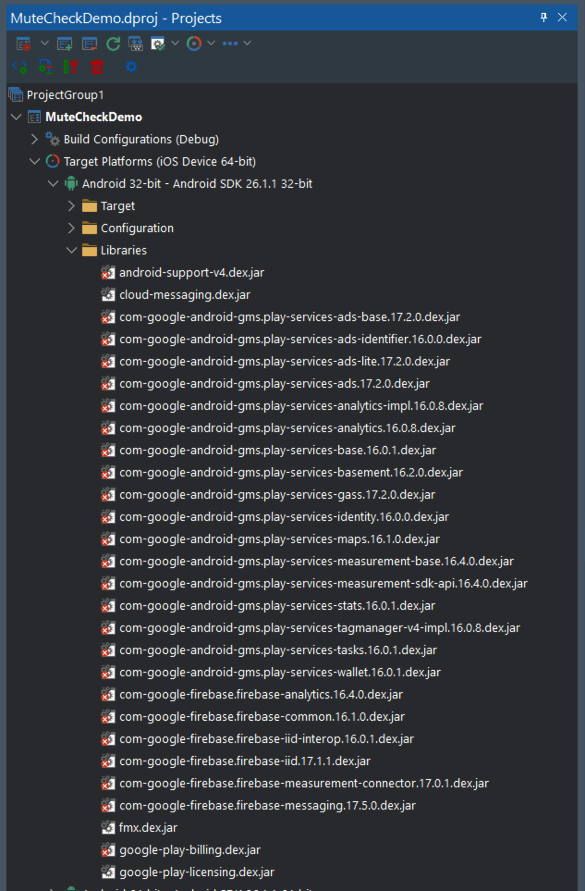
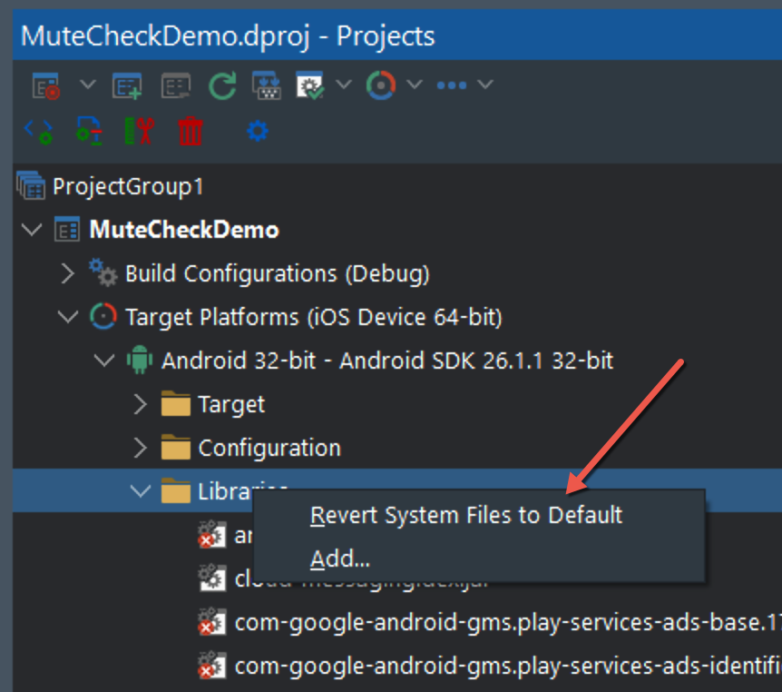

# Android Libraries Fix

## Description

Between some versions of Delphi, e.g. Delphi 10.4.x and 11.0, there may have been changes to the Android libraries (specifically, **which** libraries) that Delphi is dependent on.

If you create an app with Delphi 10.4.2, open it with Delphi 11, then open the Project Manager and expand the Android platforms nodes, under `Libraries` you will see this:

The little red "x" marks on the libraries indicate that they are not present. As mentioned above, the Android libraries that Delphi depends on have been changed. When you run the application you may receive a message like:

`Java type Jcontent_ContextCompat could not be found`

This is because the required Android libraries have not been built into the app. **With Delphi 11.1, the app will not compile because it attempts to merge the non-existent .dex files**

## How to resolve the issue

The process is rather simple:

1. Right-click the `Libraries` node, and click `Revert System Files to Default`
   

2. Do this for both Android 32-bit and Android 64-bit
3. Save the project
4. Do a Clean (right-click the **project** and click Clean)
5. Do a Build (right-click the **project** and click Build)

## Android apps with a service

If the app still crashes on startup, and you have a service with the application, it may be due to changes in the Delphi service code. In which case, follow these steps:

1. In the root of the source folder for the service, delete the `.template.java` files. This will cause Delphi to recreate them when you:
2. Rebuild the project

