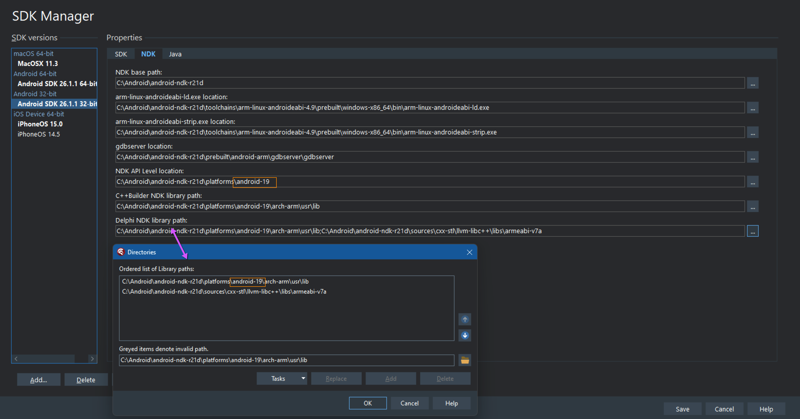

# Supporting lower Android versions

## Description

Out of the box, Delphi 11 "officially" supports Android 8.1 or higher. This might alarm some people, however the *actual* minimum version supported is determined by two things:

* In the _deployed_ AndroidManifest.xml (i.e. not AndroidManifest.template.xml), the `minSdkVersion` value determines the lowest API level supported by the app
* Since Delphi creates _native_ applications on Android, the API level used by the NDK determines the lowest supported version

By default, Delphi 11 actually sets the `minSdkVersion` to 23, so **if you're targeting Android 6 or higher, you don't need to change anything.**

The *actual* lowest supported version for Delphi 11 (this may change in later versions) is Android 4.4 (API level 19), _unless_ you are using any DataSnap related code, in which case it is Android 5 (API level 21)

## How to configure Delphi and your app for versions lower than Android 6

1. From the Delphi menu: Tools | Options > Deployment > SDK Manager
2. Select the Android SDK you wish to change the settings for
3. Select the NDK tab
4. Change the values for `NDK API Level Location` and `Delphi NDK Library Path` to reflect the desired API level, as per the image below 
Note that this image shows configuring the NDK for API level **19** (Android 4.4). For Android 5, use a value of `android-21`
5. Change the `minSdkVersion` value in `AndroidManifest.template.xml` from `%minSdkVersion%` to the lowest API level you wish to support (remembering the caveat in the description above), e.g.
```
<manifest xmlns:android="http://schemas.android.com/apk/res/android"
    package="%package%"
    android:versionCode="%versionCode%"
    android:versionName="%versionName%"
    android:installLocation="%installLocation%">
    <uses-sdk android:minSdkVersion="19" android:targetSdkVersion="%targetSdkVersion%" />
```
6. Clean and Build your project

Steps 1-4 need to be done only once, Steps 5-6 for each project
