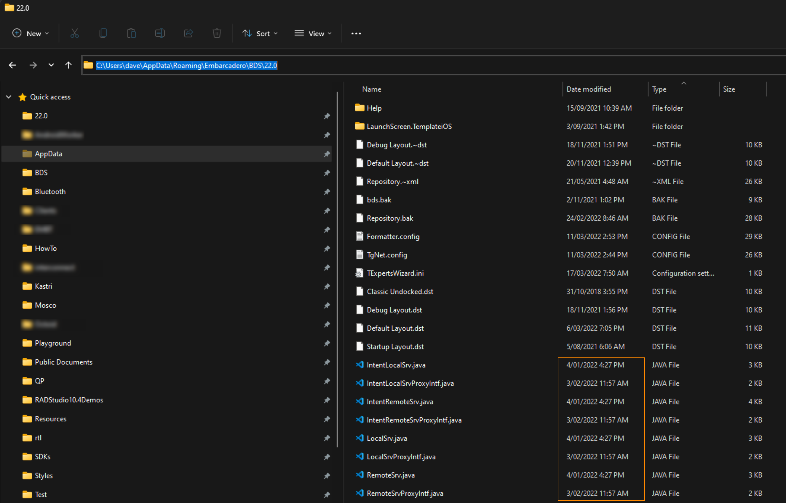

# Resolving an issue with Android Services in Delphi 11.1

## Description

In Delphi 11.1, some changes were made to the Android Service implementation which require the .java files (each of the two will have an extension of **`.template.java`**) which are in the same folder as the Service project to be updated. If you these are not updated, you may find the service crashes, despite not having changed the project.

## Solution

If you had Delphi 11 installed on the machine before upgrading to 11.1, you may find that the originals of the .java template files still exist, which are located in:

```
AppData\Roaming\Embarcadero\BDS\22.0
```

The filestamps of the template files should be similar to that pictured:



Fortunately, you should be able to resolve this by using the following steps:

1. Close Delphi
2. Delete the .java files pictured
3. Restart Delphi - this should recreate the files described

Then:

4. Delete the `.template.java` files from the **Service project folder**
5. Rebuild the app

If the installation of Delphi 11.1 is completely new (i.e. no installation of Delphi 11 existed on the machine beforehand), then you should need only do steps 4-5.
