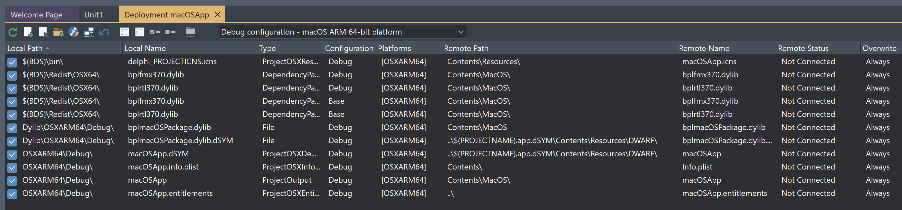
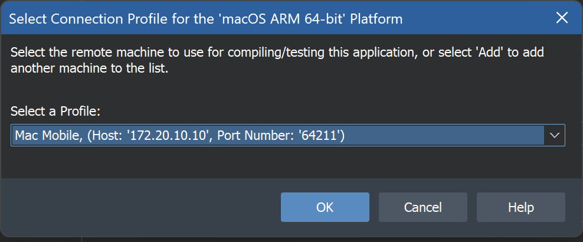
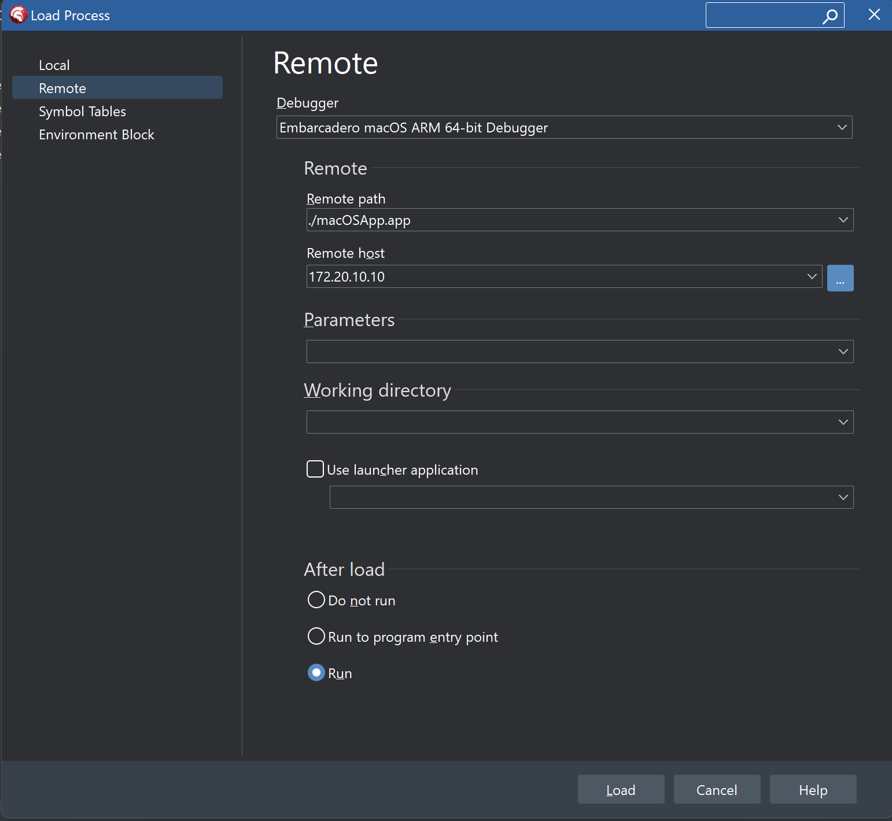

# Debugging a dylib on macOS

## Introduction

Debugging a dylib (shared library) is substantially different to that of (for example) debugging a DLL used by a Windows app.

The following describes _one way_ of achieving that - there may be other ways, however this way works at least for me.

## Steps

If you have an existing project (or more accurately: a project _group_ containing an app project and a dylib project), use the following steps. There is also a [demo](../Demos/macOSDebugDylib) in the `Demos` folder of this repo if you want to inspect how the app is configured. 

**NOTE:** The demo has a target platform of macOS ARM 64-bit - if you are targeting macOS 64-bit (i.e. Intel-based machine) the configuration would need to be updated.

1. Compile both the app and the dylib for `Debug` configuration.
2. In the Deployment Manager for the **app**, add the `.dSYM` file for the **dylib** to the deployment, with a `Remote Path` value of: `..\$(PROJECTNAME).app.dSYM\Contents\Resources\DWARF\`, e.g.:
   
   
3. In the Delphi menu, click `Run|Load Process`
4. Select `Remote`
5. In the `Remote Path` edit, enter `./` followed by the application file including the `.app` extension
6. Click the ellipsis for `Remote Host`, and select the connection profile for the Mac, e.g.:
   
   
7. In the `After Load` section, select the `Run` radio button. This is an example of the completed dialog:
   
   
8. Click `Load`

This should start the app on the Mac and launch the Delphi debugger on the Windows machine.

When the app loads the target dylib, any breakpoints set in the source code for the dylib should become active