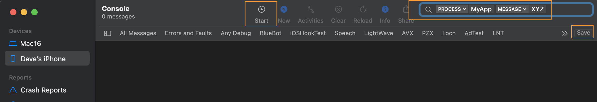

# Adding log calls to your code, and how to view them

## Description

One useful debugging technique is to add system log calls to your code, and view the log in a relevant log viewer.

## Methods you can use to create system logs

If it's an FMX app, and not an Android service, you can use `Log.d` from the `FMX.Types` unit, e.g: 

```
Log.d('XYZ: Creating an instance of TFoo');
```

This code includes the prefix `XYZ:` only to help provide something relatively unique to filter on. It does not have any other meaning and can be omitted. 

If you use [Kastri](https://github.com/DelphiWorlds/Kastri), you can use methods of `TOSLog` from the [DW.OSLog](https://github.com/DelphiWorlds/Kastri/blob/master/Core/DW.OSLog.pas) unit. The `TOSLog.d` method is the equivalent of `Log.d`, however `TOSLog` also has methods for emitting Warning level (`TOSLog.w`) and Error level (`TOSLog.e`) logs, which will categorize the log on the relevant platforms. These methods can be used in an Android service because they're not [dependent on the FMX.Types unit](https://quality.embarcadero.com/browse/RSP-17857).


## Viewing the logs

What you can use to view the log calls depends on the platform. 

### iOS, macOS

macOS includes an application called `Console`, found in the `/Applications/Utilities` folder. In order to view logs from your macOS or iOS application, select the relevant device on the left, and click the `Start` button

#### Filtering

There will be many log calls being emitted, so in order to easily see the relevant calls, a filter should be created. In the `Search` box in the top right, type in the name of the process (e.g. `MyApp`) and press enter. A dropdown then appears next to the text which defaults to `Any`. Click the down arrow and select `Process`. The logs now filter on any processes with the name just entered. These calls will include any from the system itself - if you want to filter just on the log calls you have added, you could use the technique described earlier, by having a relatively unique prefix included in the call. In the `Search` box again, type the prefix (e.g. `XYZ`) and press enter. Click the drop down and select `Message`. Now the log calls should be only those that you have added (or any system calls that happen to have the prefix in them). You can save the filter by clicking the `Save` button not far below the `Search` box, and give the filter a name. This way you can then just select the appropriate filter next time you use `Console`.

</img>

### Android

If you have Android Studio installed, the `Logcat` function can be used to view logs emitted from your app. Please refer to [the documentation](https://developer.android.com/studio/debug/am-logcat) for details.

Alternatively, you can use the [command line tool](https://developer.android.com/studio/command-line/logcat).

However, I recommend using [Device Lens](https://github.com/DelphiWorlds/DeviceLens) (I created it, so I'm a little biased), which is essentially a "front end" for the adb command. There are some basic instructions included in the readme at that link.

### Windows

The calls from `Log.d` and `TOSLog.d` on the Windows platform both use `OutputDebugString`, which means they will appear in the `Messages` window in the Delphi IDE if you use `Run With Debugging`. If you use `Run Without Debugging` or you launch your app outside of the IDE, one method of viewing the logs is to use [DebugView](https://docs.microsoft.com/en-us/sysinternals/downloads/debugview).

As per the filtering section for iOS/macOS, if you include a relatively unique prefix in the log call, it will aid in filtering calls to just those made from your app. Use the Edit | Filter/Highlight menu item, or click the Filter tool button to create a filter.


