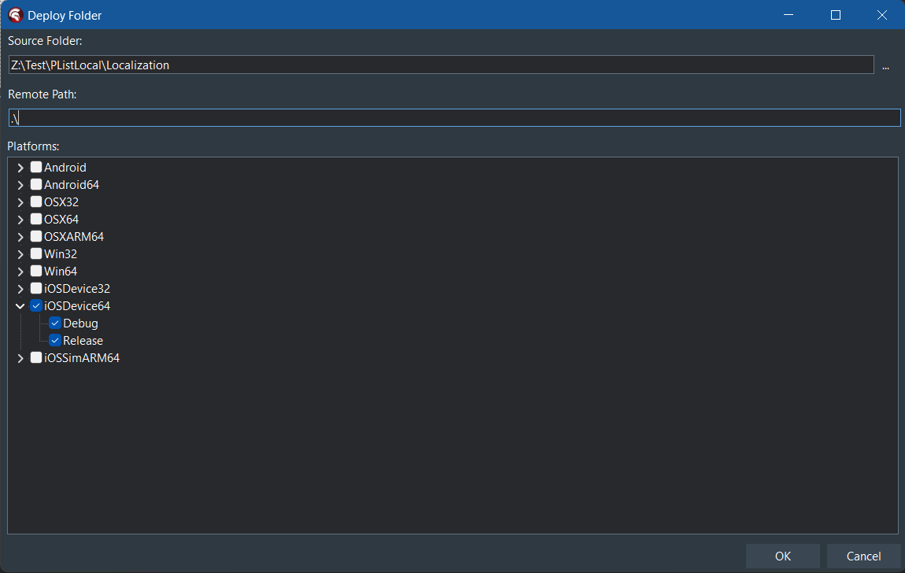

# Localization of strings contained in info.plist (iOS)

## Description

The string values in the `info.plist` file generated by Delphi (e.g. `NSCameraUsageDescription` and the corresponding value in the Version Info) are not localized by the Delphi IDE. This is a limitation of the Delphi IDE, and is not a bug.

## Solution

The solution is to create folders with an extension of `.lproj`, e.g. `en.lproj` (for English), `it.lproj` (for Italian), etc., and add an `InfoPlist.strings` file to each of them. Each of the strings in the `InfoPlist.strings` file will correspond to a value in the `info.plist` file, e.g. for `NSCameraUsageDescription` in the `InfoPlist.strings` file for `en.lproj`:

```
NSCameraUsageDescription = "This app needs camera access to take photos.";
```

And for `it.lproj`:

```
NSCameraUsageDescription = "Questa app ha bisogno di accesso alla telecamera per fare foto.";
```

And so on for each language. Each string entry needs to be terminated by a `;`, even if there is just one. Please note that the **case of the `InfoPlist.strings` file names are important**, as are the names of the `.lproj` folders.

Each of the `.lproj` folders need to be deployed to the root folder of the iOS target, e.g.:


If you have [Codex](https://github.com/DelphiWorlds/Codex) installed, you can use it to deploy all the folders and files at once, by right-clicking on the project, and selecting `Deploy Folder`, e.g.:



Where in this case, `Localization` is the name of the folder containing the `.lproj` folders.
